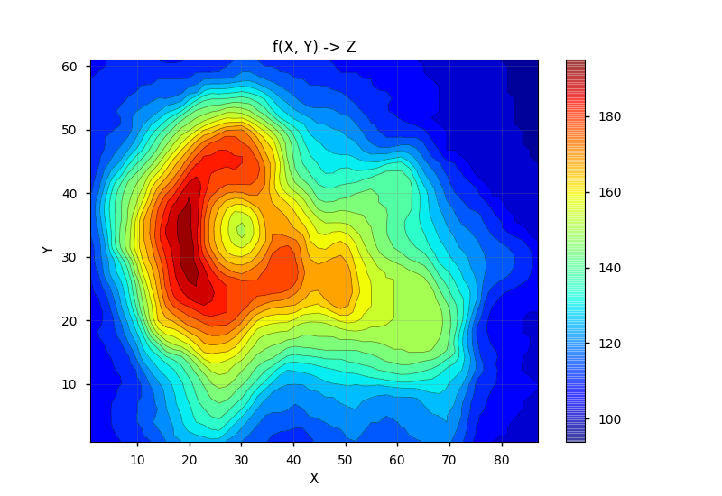

# scripts

A collection of random useful scripts - ariel faigon

### x
### xy (just a link to x, they are both the same program)
    Handy plotting command line utilities.
    Note: requires 'cuts'
    
    x  plots a density chart of a uni-dimensional numeric vector
    xy plots a scatter-plot of two numeric columns (x, y)
    
    Documentation (man page style) is included, to get it, run:

       $ perldoc x

    Note that 'xy' doesn't exist in this repository. You can
    create it by simply running this command in a shell:

        $ ln x xy

    in the directory where 'x' resides.

### cuts
    Handy cut and paste of columns (more powerful than 'cut')
    See: https://arielf.github.io/cuts/
    
### xyz
    Python (matplotlib) script to quickly plot 3D numeric data
    from the command-line.  Needs a *.tsv or *.csv input file,
    3 names (or 0-based indices) of columns to select from the file,
    and many options to control the plot.

    The default is to plot a contour map (like a topographical
    view of the Z dimension vs the X & Y dimensions).

    Emphasis on friendliness, run without arguments for usage.
    For parameter prefix matches and regexp/abbreviations are
    supported.  For example a color-map parameter, can be
    specified as any of: colormap, cmap, cm  etc.

    Example:

        xyz volcano.csv X Y Z cmap=jet zres=20

    The data file volcano.csv is included here to demonstrate
    3D data visualization (with xyz)


 
    The following names can be symlinked to the same (xyz) script.
    * If called as 'xyzb' will produce a bubble chart
    * If called as 'xyzs' will produce a scatter plot
    * If called as 'xyzp' will produce a polar plot (Y dim mapped to angle)

### colidx

    Print indices of column-names from a csv/tsv file with a header

    Example:

        colidx volcano.csv
 
### T
    Handy bi-directional/smart universal time converter
    - If it sees a Unix time_t (integer) - will convert to date
      Example:
        $ T 1443526029
        Tue Sep 29 04:27:09 2015
    - If it sees anything else - will convert to time_t
      Example:
        $ T week ago
        1443381375
    Input flexible: Works on either command-line-args OR stdin


### sorted-count-with-pct
    percentage and cumulative-percentage summary of a list of items (one per line)

    Usage example: summarize word frequency in /etc/passwd:
    $ tr -cs 'A-Za-z' '\012' < /etc/passwd | sorted-count-with-pct

### byte-entropy
    Calculates entropy of a file (or string) object by byte values.

    One pass over the file/string to summarize frequencies of each
    byte value and count total bytes.

    Another loop over the (non-zero) frequencies to calculate the entropy.

    Very simple: doesn't try to do N-gram/context/language-detection,
    Only considers char-frequencies within the object as independent
    probabilities.

    Result is always normalized to [0 .. 1] range.
    1.0 means highest-randomness.

### time-by-line
Time a sequence of commands (each output line is timed separately).

e.g. you have a test-suite, normally invoked as 'make test' with many sub-tests and we want to get the sub-tests sorted by the time they took to run.

Example:
```
    time-by-line make test
```

The output (trimmed for brevity):
```
    [normal output comes first. And after everything completes:]

    0.000006      test 42: OK
    ...
    0.149873      test 127: OK
    0.241587      test 134: OK
    0.602354      test 126: OK
```
where the 1st column is number of seconds a line took to complete, and the lines are sorted by the time the individual sub-tests took to run.

Invocation is flexible. You can also use 'time-by-line' in a pipe:

```
    make test |& time-by-line
```

There are 2 different ways to attribute times to lines:

* Attribute time to 1st line in a sequence (starting line)
* Attribute time to 2nd line in a sequence (ending line)

The default used by `time-by-line` is to attribute times to the ending-line

To change the default, simply pass `-` or `--` as the 1st argument to `time-by-line`:
```
    # Will attribute each time-slot duration to its 1st line:
    time-by-line -- make test

    # ditto:
    make test |& time-by-line --
```

